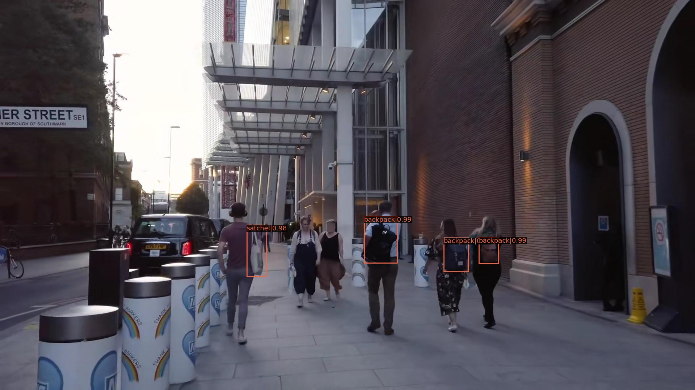
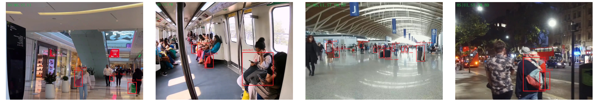
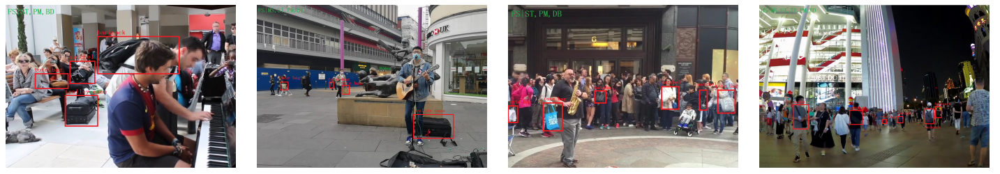
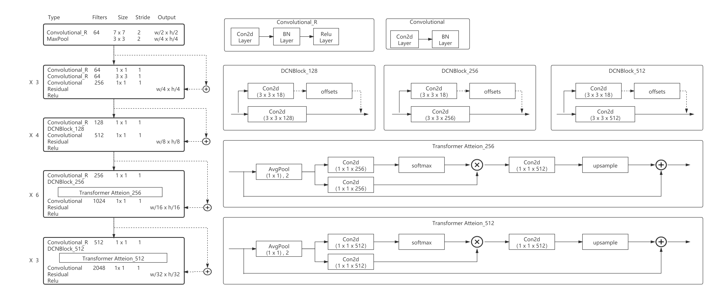

# Exploring Complex Scene Bag Detection with A New Dataset and A New Method

## Introduction
Bags often appear in various scenarios. Existing works only focus on bags as an auxiliary attribute or subclass.
We first study the bag as a single specific object and establish a series of requirements of new task: problem definition, dataset construction, evaluation standard definition, propose solutions and rich experimental analysis.
Similar to general object detection, bag detection requires the algorithm to give the location and category information of various bags. 
However, there does not exist a dataset designed for such a task.
To facilitate the study of this task, we collect a large-scale bag detection dataset with accurate position and category annotation, named as Bag6k.
Together with the dataset, we introduce a multi-stage evaluation metric and divide the training, validation, and testing subsets to fairly evaluate the performance of various algorithms, designing a new benchmark for the bag detection task.
More importantly, we propose a Cascade Bag Detection network (CBDet) as a strong baseline, which consists of several novel components to help our method achieve state-of-the-art performance.
Comparative experiments are conducted on the proposed Bag6k to demonstrate its significance and the multi-view ablation study is provided to point out the direction of future efforts.

## Dataset
In order to ensure the diversity of the dataset, this dataset is derived from network videos in five common scenes, namely subway, railway station, street, shopping mall and street night scene. The video contains two resolution sizes of 1080P/30FPS and 720P/30FPS. 
The method of selecting frames from 30 frames to one frame is adopted to select and filter the approximately repeated frames. 6505 video frames were saved. The mall scene contains 226 pictures, the subway station 96 pictures, the railway station 1144 pictures, the street 5039 pictures, including the night scene 1275 pictures.We used [LabelImg](https://github.com/tzutalin/labelImg.git) to mark 21,457 objects.

We finally determined 4 bag categories, and the labeling rules are as follows:
- backpack: We mark four states of backpacks (i.e., backpack on the back and shooting view on the back, backpack on the front and shooting view on the front, backpack on the back and shooting view on the front, and independently placed backpack).
- satchel: We define satchel as a bag that is usually carried mainly on the arm or shoulder (e.g., shoulder bag, cross-body, sling bag, saddle bag, etc.).
- trolley case: We refer to luggage and trolleys as trolley cases.
- tote bag: We define the handheld-based bag as tote bag (for example, shopping bags, plastic bags, portable tote bags, paper bags, etc.).

Examples of the collected Bag6k dataset. It spans various challenges of fixed monitoring shooting and handheld terminal shooting (shorted by FS and HS) in scene package detection. For instance, multiple scales (MS), uneven illumination (UI), similar texture (ST), partial mask (PM), blurring and deformation (BD), complex pose and background (CPB). The red region of the upper right corner describes the shooting mode and the challenges of text detection, (mode|challenges). Best viewed in  [img](https://github.com/jsjxyjl/CBDet/tree/main/img).

 
Datasets are available on the [Baidu](https://pan.baidu.com/s/1haikTU21CEcKGjH67cbCfg) and [Google Drive](https://drive.google.com/file/d/1NptjvTXS5hU2pA_25XNWY30h7qKIZ_iD/view?usp=sharing)

- The extraction code is `bagd`

## Implements and Experimental 

### Backbone network architecture

### Prerequisites
We implemented CBDet using MMDetection and  Pytorch.
- The project lists the code for CBDet, and the rest of the base code is in [MMDetection](https://github.com/open-mmlab/mmdetection.git)  

|   -             | Require         | Ours   |
| :-------------: | :----:          |:------:|
|    OS           | Linux or macOS  | ubantu |
| Python          |3.6+             |  3.8.10|
| PyTorch         |1.3+             |  1.7.0  |
| CUDA            |9.2+             |  11.1   |
| GCC             |5+               |  7.5.0  |
| [MMCV](https://mmcv.readthedocs.io/en/latest/#installation)            | -                |  1.2.4  |
| [MMDetection](https://mmdetection.readthedocs.io/en/latest/)           | -                |  2.7    |

## Results and models

### CBDet

|    Method     | box AP | Config   |
| :-------------: | :----: |:------:|
|    Retinanet    | 0.254  | [config](https://github.com/open-mmlab/mmdetection/blob/master/configs/retinanet/retinanet_r50_fpn_1x_coco.py) | 
|    YOLO v3      | 0.278  | [config](https://github.com/open-mmlab/mmdetection/blob/master/configs/yolo/yolov3_d53_320_273e_coco.py) | 
|    FCOS         | 0.340  | [config](https://github.com/open-mmlab/mmdetection/blob/master/configs/fcos/fcos_r50_caffe_fpn_gn-head_1x_coco.py) | 
|     Faster RCNN | 0.347  | [config](https://github.com/open-mmlab/mmdetection/blob/master/configs/faster_rcnn/faster_rcnn_r50_fpn_1x_coco.py) |
|    Grid Rcnn    | 0.351  | [config](https://github.com/open-mmlab/mmdetection/blob/master/configs/grid_rcnn/grid_rcnn_r50_fpn_gn-head_1x_coco.py) | 
|   Cascade Rcnn  | 0.352  | [config](https://github.com/jsjxyjl/CBDet/blob/main/configs/cascade_rcnn/cascade_rcnn.py)  | 
|    PAA          | 0.371  | [config](https://github.com/open-mmlab/mmdetection/blob/master/configs/paa/paa_r50_fpn_1x_coco.py) | 
|    CBDet        | 0.375  | [config](https://github.com/jsjxyjl/CBDet/blob/main/configs/CBDet/cbdet_aasrpn_t-attention_dcn.py) | 

### Ablation study

|    Method     | box AP | Config |
| :-------------: | :----: |:------:|
|   CBDet+AAS-RPN       |0.359   | [config](https://github.com/jsjxyjl/CBDet/blob/main/configs/CBDet/cbdet_aasrpn.py) |
|   CBDet+AAS-RPN+T-Attention   |0.364   | [config](https://github.com/jsjxyjl/CBDet/blob/main/configs/CBDet/cbdet_aasrpn_t-attention.py) | 
|   CBDet+AAS-RPN+DCN       |0.371   | [config](https://github.com/jsjxyjl/CBDet/blob/main/configs/CBDet/cbdet_aasrpn_dcn.py) | 
|   CBDet+T-Attention+DCN |0.372   | [config](https://github.com/jsjxyjl/CBDet/blob/main/configs/CBDet/cbdet_t-attention_dcn.py) |
|   CBDet+AAS-RPN+T-Attention+DCN      | 0.375  | [config](https://github.com/jsjxyjl/CBDet/blob/main/configs/CBDet/cbdet_aasrpn_t-attention_dcn.py) |

models are available on the [Baidu](https://pan.baidu.com/s/1LkGscZm17qUp3vsho06B7A ) and [Google Drive](https://drive.google.com/file/d/1NlKeQBJbl4HQtX5ldO_PipfJMkcFMDYX/view?usp=sharing)
- - The extraction code is `bagd`
